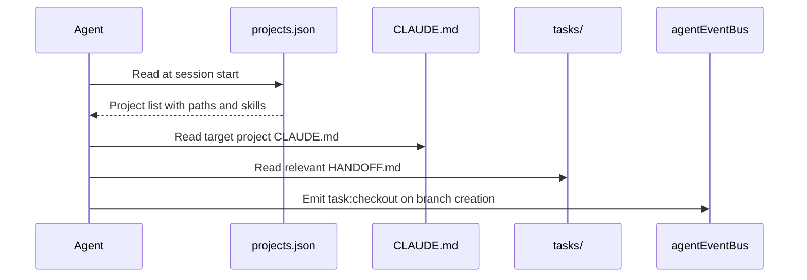

# PDR 01 -- Sandbox and Project Registry

## Purpose

Defines how all GrizzwaldHouse projects are discovered and accessed by agents without hard-coded paths.

## Key Files

| File | Path | Responsibility |
|------|------|---------------|
| Project registry | `projects.json` | All active projects with paths, roles, skills |
| Hub CLAUDE.md | `CLAUDE.md` | AgentForge coding standards and skill references |
| Task root | `tasks/` | All AgentForge HANDOFF.md task files |

## projects.json Schema

```json
{
  "version": "1.0",
  "updatedAt": "YYYY-MM-DD",
  "projects": [{
    "id": "string (kebab-case)",
    "name": "string (display name)",
    "path": "string (absolute Windows path)",
    "role": "hub | asset-pipeline | automation | marketing | game | system-prompts",
    "claudeMd": "string | null (absolute path to CLAUDE.md if it exists)",
    "skills": ["skill-name (from C:\\ClaudeSkills)"],
    "active": true
  }]
}
```

## How Agents Read the Registry

At session start, read `projects.json` from the AgentForge root.
Never ask the user for a path that is already in the registry.
If a project is missing from the registry, add it and commit before starting work.

## Event Flow


