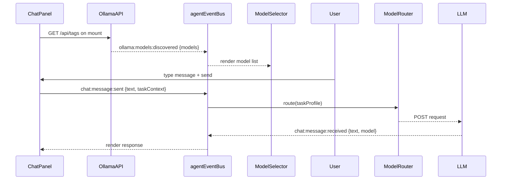

# PDR 03 -- Chatbot and Model Routing

## Purpose

Defines the chatbot UI added to the AgentForge dashboard and how messages are routed to local Ollama models via the existing ModelRouter.

## Key Files

| File | Path | Responsibility |
|------|------|---------------|
| Chat route | `src/app/dashboard/chat/page.tsx` | Next.js route |
| Chat panel | `src/components/chat-panel.tsx` | Message UI |
| Model selector | `src/components/model-selector.tsx` | Ollama model picker |
| Model router | `src/routing/ModelRouter.ts` | Task-type routing (existing) |
| Event bus | `src/core/events/agent-event-bus.ts` | All events (existing, singleton) |

## Ollama Model Discovery

On chat route load, call `http://localhost:11434/api/tags` (Ollama local API).
Emit `ollama:models:discovered` with the model list via `agentEventBus`.
`model-selector.tsx` listens for this event and populates the dropdown reactively.
If Ollama is unreachable, emit `ollama:models:offline` and show fallback models from `src/config/env.ts`.

## Context Sent to Model

For every chat session scoped to a project task:
1. Project `CLAUDE.md` (path from `projects.json`)
2. Current task `HANDOFF.md` (the task the user is working on)

Nothing else. This fits within any model's context window including 7B class local models.

## Event Flow

## Model Routing Table

Routing uses existing `TaskDomain` types in `src/routing/types.ts`:

| Chat task type | Routes to | Fallback |
|---------------|-----------|---------|
| code-generation | ollama | groq |
| code-review | ollama | groq |
| planning | ollama | groq |
| general | ollama | groq |
