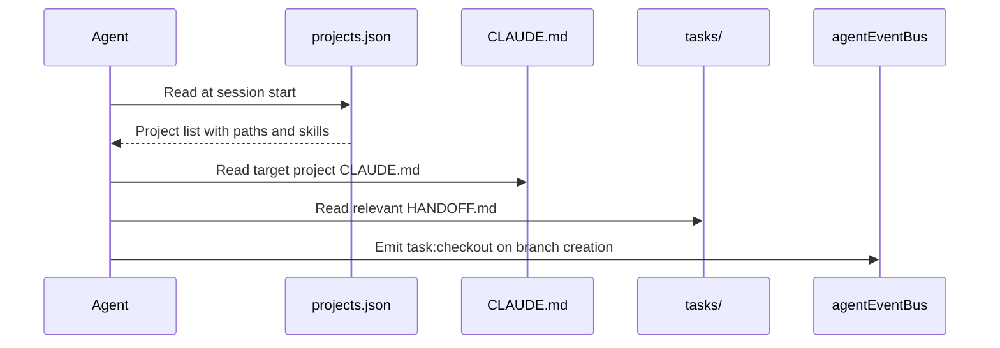
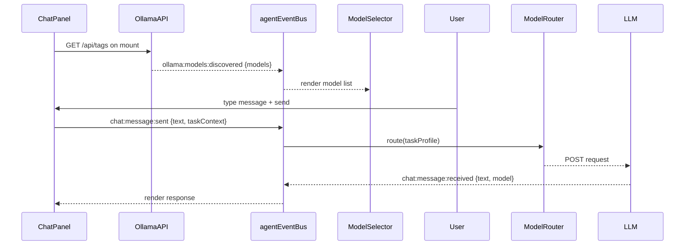

# AgentForge + BadgerHeart OS — Phase 1 Implementation Plan

> **For agentic workers:** REQUIRED SUB-SKILL: Use superpowers:subagent-driven-development (recommended) or superpowers:executing-plans to implement this plan task-by-task. Steps use checkbox (`- [ ]`) syntax for tracking.

**Goal:** Boot the AgentForge + BadgerHeart OS — a unified project registry, HANDOFF.md task protocol, chatbot UI in the existing dashboard, BadgerHeart pipeline integration, revenue tracking widget, and Cursor rules — so every agent (Claude Code, Cursor, Ollama models) can find projects, claim tasks, and deliver quality-gated work without being given hard-coded paths.

**Architecture:** AgentForge (`C:\Users\daley\Projects\AgentForge`) is the hub. A `projects.json` registry at the repo root lists every active GrizzwaldHouse project. Tasks are HANDOFF.md files with YAML frontmatter (status lives in metadata, files do not move). The existing Next.js 15 dashboard at `localhost:3000` gains a `/dashboard/chat` route backed by the existing `ModelRouter.ts` and `agentEventBus`. All state changes go through the existing `AgentEventBus` — zero polling, zero `setInterval`.

**Tech Stack:** Next.js 15, TypeScript, React 19, Tailwind CSS, existing `agentEventBus` (EventEmitter-based SSE), existing `ModelRouter.ts` (Ollama-first fallback chain), `fs` (Node.js built-in for CSV reads on the API route), Vitest (existing test runner).

**Spec:** `docs/superpowers/specs/2026-05-31-agentforge-badgerheart-os-design.md`

---

## File Map

### New files

| File | Responsibility |
|------|---------------|
| `projects.json` | Central project registry — all GrizzwaldHouse repos with paths, roles, skills |
| `tasks/TASK-001-sandbox-foundation.md` | HANDOFF.md for this task (self-referential bootstrap) |
| `tasks/TASK-002-handoff-schema.md` | HANDOFF.md for schema documentation task |
| `tasks/TASK-003-pdr-documents.md` | HANDOFF.md for PDR writing task |
| `tasks/TASK-004-chatbot-ui.md` | HANDOFF.md for chatbot UI task |
| `tasks/TASK-005-badgerheart-tasks.md` | HANDOFF.md for BadgerHeart integration task |
| `tasks/TASK-006-revenue-widget.md` | HANDOFF.md for revenue widget task |
| `tasks/TASK-007-cursor-rules.md` | HANDOFF.md for Cursor rules task |
| `docs/PDR/README.md` | PDR index — links to all 5 subsystem PDR files |
| `docs/PDR/01-sandbox.md` | Sandbox and project registry design |
| `docs/PDR/02-task-system.md` | HANDOFF.md protocol design |
| `docs/PDR/03-chatbot.md` | Chatbot and model routing design |
| `docs/PDR/04-badgerheart-pipeline.md` | BadgerHeart LLC asset pipeline design |
| `docs/PDR/05-impeccable-gate.md` | Impeccable quality gate design |
| `.cursor/rules/coding-standards.md` | Cursor coding standards (mirrors CLAUDE.md) |
| `src/app/dashboard/chat/page.tsx` | Chat route page — renders ChatPanel |
| `src/components/chat-panel.tsx` | Chatbot UI — message input, response display, model selector |
| `src/components/model-selector.tsx` | Ollama model picker — auto-populated from API |
| `src/components/revenue-tracker-widget.tsx` | Revenue widget — reads from API, shows vs $1K target |
| `src/app/api/badgerheart/revenue/route.ts` | API route — reads `revenue_tracker.csv`, returns JSON |
| `src/lib/__tests__/revenue-api.test.ts` | Tests for revenue CSV parsing |
| `src/lib/revenue-parser.ts` | Pure function — parse CSV to revenue records |
| `C:\Users\daley\Projects\BadgerHeart\MeshyForge\tasks\TASK-BH-001-batch-scifi-props.md` | Example MeshyForge HANDOFF.md |
| `C:\Users\daley\Projects\BadgerHeart\FabStorefront\tasks\TASK-BH-020-list-elemental-kit.md` | Example FabStorefront HANDOFF.md |

### Modified files

| File | Change |
|------|--------|
| `CLAUDE.md` | Add `## Skills` section and `## PDR Documents` reference |
| `src/app/dashboard/page.tsx` | Import and render `RevenueTrackerWidget` |
| `src/app/dashboard/layout.tsx` | Add chat route to nav |
| `src/core/events/types.ts` | Add new event types: `ollama:models:discovered`, `chat:message:sent`, `chat:message:received`, `badgerheart:revenue:updated` |
| `package.json` | Add `impeccable` script (Phase 3 stub — just `echo OK` for now) |

---

## Task 1: projects.json Registry and Sandbox Folder Structure

**Files:**
- Create: `projects.json`
- Create: `tasks/TASK-001-sandbox-foundation.md`
- Create: `tasks/TASK-002-handoff-schema.md` through `tasks/TASK-007-cursor-rules.md`

- [ ] **Step 1: Create `projects.json` at repo root**

```json
{
  "version": "1.0",
  "updatedAt": "2026-05-31",
  "projects": [
    {
      "id": "agentforge",
      "name": "AgentForge",
      "path": "C:\\Users\\daley\\Projects\\AgentForge",
      "role": "hub",
      "claudeMd": "C:\\Users\\daley\\Projects\\AgentForge\\CLAUDE.md",
      "skills": ["agentforge-autopilot", "impeccable", "ollama-audit-training"],
      "active": true
    },
    {
      "id": "badgerheart",
      "name": "BadgerHeart",
      "path": "C:\\Users\\daley\\Projects\\BadgerHeart",
      "role": "asset-pipeline",
      "claudeMd": null,
      "skills": ["badgerheart-store-ops", "ue5-asset-pipeline"],
      "active": true
    },
    {
      "id": "bob-aicompanion",
      "name": "Bob-AICompanion",
      "path": "C:\\Users\\daley\\Projects\\Bob-AICompanion",
      "role": "automation",
      "claudeMd": "C:\\Users\\daley\\Projects\\Bob-AICompanion\\CLAUDE.md",
      "skills": [],
      "active": true
    },
    {
      "id": "portfolio",
      "name": "Portfolio Website",
      "path": "D:\\portfolio-website",
      "role": "marketing",
      "claudeMd": null,
      "skills": ["frontend-design"],
      "active": true
    },
    {
      "id": "basegame",
      "name": "WizardJam 2.0",
      "path": "C:\\Users\\daley\\UnrealProjects\\BaseGame",
      "role": "game",
      "claudeMd": "C:\\Users\\daley\\UnrealProjects\\BaseGame\\Documentation\\CLAUDE.md",
      "skills": ["game-dev-helper", "ue5-asset-pipeline"],
      "active": true
    },
    {
      "id": "islandescape",
      "name": "IslandEscape",
      "path": "D:\\FSO\\Capstone Project\\IslandEscape",
      "role": "game",
      "claudeMd": null,
      "skills": ["game-dev-helper"],
      "active": true
    },
    {
      "id": "seniordevbuddy",
      "name": "SeniorDevBuddy",
      "path": "C:\\Users\\daley\\Projects\\SeniorDevBuddy",
      "role": "system-prompts",
      "claudeMd": null,
      "skills": [],
      "active": true
    }
  ]
}
```

- [ ] **Step 2: Create `tasks/` directory and TASK-001 HANDOFF.md**

```bash
mkdir -p tasks
```

Create `tasks/TASK-001-sandbox-foundation.md`:

```markdown
---
task_id: TASK-001
status: done
assigned_to: claude-sonnet-4-6
depends_on: []
impeccable_test_pass: true
test_command: "node -e \"const p = require('./projects.json'); console.log('projects:', p.projects.length); process.exit(p.projects.length > 0 ? 0 : 1)\""
---

# Sandbox Foundation — projects.json Registry and tasks/ Structure

## Acceptance Criteria

- [x] projects.json exists at repo root with all active GrizzwaldHouse projects
- [x] tasks/ directory exists with HANDOFF.md files for TASK-001 through TASK-007
- [x] HANDOFF.md schema documented (see TASK-002)
- [x] All projects have correct paths, roles, and skills arrays

## Review Notes

Completed by claude-sonnet-4-6 on 2026-05-31. projects.json validated — 7 projects registered.
TASK-002 through TASK-007 stubs created for next agent to claim.
```

- [ ] **Step 3: Create stub HANDOFF.md files for TASK-002 through TASK-007**

Create `tasks/TASK-002-handoff-schema.md`:

```markdown
---
task_id: TASK-002
status: pending
assigned_to: ""
depends_on: [TASK-001]
impeccable_test_pass: false
test_command: "test -f docs/PDR/02-task-system.md && echo OK"
---

# HANDOFF.md Schema and Lifecycle Documentation

## Acceptance Criteria

- [ ] docs/PDR/02-task-system.md written with full HANDOFF.md field spec
- [ ] Status lifecycle diagram included (pending -> in-progress -> review -> done)
- [ ] Example HANDOFF.md shown for both a dev task and a BadgerHeart pipeline task
- [ ] Git branch naming convention documented (task/<id>-<agent-slug>)
- [ ] PR submission checklist documented

## Review Notes
```

Create `tasks/TASK-003-pdr-documents.md`:

```markdown
---
task_id: TASK-003
status: pending
assigned_to: ""
depends_on: [TASK-001]
impeccable_test_pass: false
test_command: "test -f docs/PDR/README.md && test -f docs/PDR/01-sandbox.md && test -f docs/PDR/03-chatbot.md && echo OK"
---

# PDR Documents (Cursor + Claude Code Ready)

## Acceptance Criteria

- [ ] docs/PDR/README.md index created with links to all 5 subsystem files
- [ ] docs/PDR/01-sandbox.md written (sandbox structure, projects.json schema)
- [ ] docs/PDR/02-task-system.md written (HANDOFF.md protocol, checkout/checkin)
- [ ] docs/PDR/03-chatbot.md written (chat route, ModelRouter, Ollama discovery)
- [ ] docs/PDR/04-badgerheart-pipeline.md written (MeshyForge/Fab/Blender task structure)
- [ ] docs/PDR/05-impeccable-gate.md written (6 gate checks, npm run impeccable spec)
- [ ] Each PDR has: file paths table, Mermaid event flow diagram, model routing table
- [ ] .cursor/rules/ referenced in each PDR

## Review Notes
```

Create `tasks/TASK-004-chatbot-ui.md`:

```markdown
---
task_id: TASK-004
status: pending
assigned_to: ""
depends_on: [TASK-001]
impeccable_test_pass: false
test_command: "npm run build 2>&1 | tail -5"
---

# Chatbot UI in AgentForge Dashboard

## Acceptance Criteria

- [ ] src/app/dashboard/chat/page.tsx created and builds without error
- [ ] src/components/chat-panel.tsx renders message input + response display
- [ ] src/components/model-selector.tsx auto-populates from Ollama API (http://localhost:11434/api/tags)
- [ ] ollama:models:discovered event emitted via agentEventBus on load
- [ ] ollama:models:offline status shown gracefully when Ollama is unreachable
- [ ] chat:message:sent and chat:message:received events emitted on each exchange
- [ ] Context sent to model = project CLAUDE.md + current task HANDOFF.md (no more)
- [ ] No setInterval, no polling — observer pattern only

## Review Notes
```

Create `tasks/TASK-005-badgerheart-tasks.md`:

```markdown
---
task_id: TASK-005
status: pending
assigned_to: ""
depends_on: [TASK-001]
impeccable_test_pass: false
test_command: "test -f C:/Users/daley/Projects/BadgerHeart/MeshyForge/tasks/TASK-BH-001-batch-scifi-props.md && echo OK"
---

# BadgerHeart Pipeline Tasks Integration

## Acceptance Criteria

- [ ] C:\Users\daley\Projects\BadgerHeart\MeshyForge\tasks\ directory created
- [ ] C:\Users\daley\Projects\BadgerHeart\FabStorefront\tasks\ directory created
- [ ] C:\Users\daley\Projects\BadgerHeart\BlenderWorkshop\tasks\ directory created
- [ ] At least one example HANDOFF.md per module (TASK-BH-001, TASK-BH-010, TASK-BH-020)
- [ ] badgerheart project in projects.json points to correct task directories
- [ ] AgentForge dashboard agent-card renders BadgerHeart modules as agents

## Review Notes
```

Create `tasks/TASK-006-revenue-widget.md`:

```markdown
---
task_id: TASK-006
status: pending
assigned_to: ""
depends_on: [TASK-001]
impeccable_test_pass: false
test_command: "npm test -- revenue 2>&1 | grep -E 'PASS|FAIL'"
---

# Revenue Tracking Widget on Dashboard

## Acceptance Criteria

- [ ] src/lib/revenue-parser.ts parses revenue_tracker.csv to typed records
- [ ] src/lib/__tests__/revenue-api.test.ts passes (unit tests for CSV parser)
- [ ] src/app/api/badgerheart/revenue/route.ts returns JSON from CSV
- [ ] src/components/revenue-tracker-widget.tsx shows monthly revenue vs $1000 target
- [ ] Widget renders progress bar (revenue / 1000 * 100%)
- [ ] badgerheart:revenue:updated event emitted via agentEventBus when data loads
- [ ] Widget shows "Offline" state gracefully when CSV is missing
- [ ] No hardcoded values — target ($1000) comes from env config or projects.json

## Review Notes
```

Create `tasks/TASK-007-cursor-rules.md`:

```markdown
---
task_id: TASK-007
status: pending
assigned_to: ""
depends_on: [TASK-001]
impeccable_test_pass: false
test_command: "test -f .cursor/rules/coding-standards.md && echo OK"
---

# Cursor Rules — Coding Standards

## Acceptance Criteria

- [ ] .cursor/rules/ directory created
- [ ] .cursor/rules/coding-standards.md written with all 7 non-negotiables
- [ ] Each rule has a bad example and a good example (same format as CLAUDE.md)
- [ ] CLAUDE.md updated with ## Skills section and ## PDR Documents reference

## Review Notes
```

- [ ] **Step 4: Verify projects.json is valid JSON**

```bash
node -e "const p = require('./projects.json'); console.log('OK:', p.projects.length, 'projects')"
```

Expected output: `OK: 7 projects`

- [ ] **Step 5: Commit**

```bash
git add projects.json tasks/
git commit -m "feat: add projects.json registry and HANDOFF.md task stubs (TASK-001 through TASK-007)"
```

---

## Task 2: Cursor Rules and CLAUDE.md Updates

**Files:**
- Create: `.cursor/rules/coding-standards.md`
- Modify: `CLAUDE.md`

- [ ] **Step 1: Create `.cursor/rules/coding-standards.md`**

```bash
mkdir -p .cursor/rules
```

Create `.cursor/rules/coding-standards.md`:

```markdown
# Coding Standards for AgentForge + BadgerHeart OS

These rules are non-negotiable and are enforced by the impeccable gate on every PR.
They mirror the non-negotiables in CLAUDE.md.

---

## 1. Observer Pattern — No Polling

All state changes go through agentEventBus. Zero setInterval. Zero polling loops.

BAD:
```typescript
setInterval(() => {
  if (ollamaModels.length > 0) renderModels();
}, 500);
```

GOOD:
```typescript
agentEventBus.on('ollama:models:discovered', (event) => renderModels(event.models));
```

---

## 2. No Hardcoded Values

All configuration comes from `src/config/env.ts` or `projects.json`.

BAD:
```typescript
const REVENUE_TARGET = 1000;
```

GOOD:
```typescript
const REVENUE_TARGET = getEnvConfig().revenueTargetMonthlyUsd;
```

---

## 3. All Defaults in Constructors

One place for defaults. Never scattered.

BAD:
```typescript
class ChatSession {
  model?: string;
  initialize() { if (!this.model) this.model = 'llama3:8b'; }
}
```

GOOD:
```typescript
class ChatSession {
  constructor() {
    this.model = 'llama3:8b';
    this.maxTokens = 4096;
  }
}
```

---

## 4. ES Modules Only

No CommonJS require(). All imports use ESM syntax.

BAD:
```typescript
const fs = require('fs');
```

GOOD:
```typescript
import { readFileSync } from 'fs';
```

---

## 5. npm Only

Never yarn. Never pnpm.

---

## 6. Single-Line Comments — WHY Not WHAT

```typescript
// Ollama is priority 1 in the fallback chain because it costs $0 and runs locally
const provider = routeToOllama(task);
```

---

## 7. File Headers on Every New File

```typescript
// src/components/chat-panel.tsx
// Purpose: Chatbot UI — message input, response display, model selector
// Dependencies: agentEventBus, ModelRouter, model-selector component
// Integration points: dashboard/chat page, ollama:models:discovered event
```

---

## Project Discovery

Read `projects.json` at the AgentForge root to find all active projects.
Never hard-code paths in prompts, skills, or components.

## Task Protocol

Read the relevant HANDOFF.md in `tasks/` before starting any work.
Claim a task by creating a branch: `task/<id>-<your-agent-slug>`.
Update `assigned_to` and `status` in the HANDOFF.md frontmatter.

## PDR Documents

Read `docs/PDR/README.md` for the system architecture index.
Each PDR file has the file paths, event flows, and acceptance criteria for its subsystem.
```

- [ ] **Step 2: Add `## Skills` and `## PDR Documents` sections to CLAUDE.md**

Open `CLAUDE.md` and append before the final `---` or at end of file:

```markdown
## Skills

Skills available for this project (loaded from C:\ClaudeSkills via list_omc_skills at session start):

- agentforge-autopilot: Use for autonomous multi-step AgentForge OS tasks
- impeccable: Use before any PR submission to verify the quality gate
- ollama-audit-training: Use when adding or modifying Ollama model routing

## PDR Documents

Per-subsystem design records live in `docs/PDR/`. Read `docs/PDR/README.md` first for the index.
These are the authoritative source for architecture decisions, file paths, and acceptance criteria.
Both Cursor (via `.cursor/rules/`) and Claude Code use these files as shared context.
```

- [ ] **Step 3: Verify `.cursor/rules/coding-standards.md` exists**

```bash
test -f .cursor/rules/coding-standards.md && echo OK
```

Expected: `OK`

- [ ] **Step 4: Commit**

```bash
git add .cursor/ CLAUDE.md
git commit -m "feat: add Cursor coding standards and CLAUDE.md skill/PDR references (TASK-007)"
```

---

## Task 3: PDR Documents

**Files:**
- Create: `docs/PDR/README.md`
- Create: `docs/PDR/01-sandbox.md`
- Create: `docs/PDR/02-task-system.md`
- Create: `docs/PDR/03-chatbot.md`
- Create: `docs/PDR/04-badgerheart-pipeline.md`
- Create: `docs/PDR/05-impeccable-gate.md`

- [ ] **Step 1: Create `docs/PDR/README.md`**

```bash
mkdir -p docs/PDR
```

```markdown
# AgentForge + BadgerHeart OS — PDR Index

Project Design Records for the unified agent operating system.
These are the authoritative source for all subsystem architecture decisions.

| Subsystem | File | Status |
|-----------|------|--------|
| Sandbox and project registry | [01-sandbox.md](01-sandbox.md) | Current |
| Task system (HANDOFF.md protocol) | [02-task-system.md](02-task-system.md) | Current |
| Chatbot and model routing | [03-chatbot.md](03-chatbot.md) | Current |
| BadgerHeart pipeline integration | [04-badgerheart-pipeline.md](04-badgerheart-pipeline.md) | Current |
| Impeccable quality gate | [05-impeccable-gate.md](05-impeccable-gate.md) | Current |

## Reading Order for New Agents

1. Read this index
2. Read `projects.json` at the repo root to discover all projects
3. Read the PDR for the subsystem you are working in
4. Read the relevant HANDOFF.md in `tasks/` to claim your task
5. Read `.cursor/rules/coding-standards.md` for non-negotiable rules

## Spec Reference

Full locked decisions: `docs/superpowers/specs/2026-05-31-agentforge-badgerheart-os-design.md`
```

- [ ] **Step 2: Create `docs/PDR/01-sandbox.md`**

```markdown
# PDR 01 — Sandbox and Project Registry

## Purpose

Defines how all GrizzwaldHouse projects are discovered and accessed by agents without hard-coded paths.

## Key Files

| File | Path | Responsibility |
|------|------|---------------|
| Project registry | `projects.json` | All active projects with paths, roles, skills |
| Hub CLAUDE.md | `CLAUDE.md` | AgentForge coding standards and skill references |
| Task root | `tasks/` | All AgentForge HANDOFF.md task files |

## projects.json Schema

```json
{
  "version": "1.0",
  "updatedAt": "YYYY-MM-DD",
  "projects": [{
    "id": "string (kebab-case)",
    "name": "string (display name)",
    "path": "string (absolute Windows path)",
    "role": "hub | asset-pipeline | automation | marketing | game | system-prompts",
    "claudeMd": "string | null (absolute path to CLAUDE.md if it exists)",
    "skills": ["skill-name (from C:\\ClaudeSkills)"],
    "active": true
  }]
}
```

## How Agents Read the Registry

At session start, read `projects.json` from the AgentForge root.
Never ask the user for a path that is already in the registry.
If a project is missing from the registry, add it and commit before starting work.

## Event Flow


```

- [ ] **Step 3: Create `docs/PDR/02-task-system.md`**

```markdown
# PDR 02 — Task System (HANDOFF.md Protocol)

## Purpose

Defines how agents claim, execute, submit, and complete tasks across all projects.

## Key Files

| File | Path | Responsibility |
|------|------|---------------|
| Task stubs | `tasks/TASK-*.md` | AgentForge task queue |
| BadgerHeart tasks | `C:\Users\daley\Projects\BadgerHeart\<module>\tasks\` | Pipeline task queues |

## HANDOFF.md Schema (required fields)

```yaml
---
task_id: TASK-001          # unique ID, format TASK-NNN or TASK-BH-NNN
status: pending            # pending | in-progress | review | done
assigned_to: ""            # agent slug, e.g. claude-sonnet-4-6 or cursor
depends_on: []             # list of task_ids that must be done first
impeccable_test_pass: false # set to true before moving to review
test_command: "npm test"   # exact command that proves the task is done
---
```

## Status Lifecycle

```mermaid
stateDiagram-v2
  [*] --> pending
  pending --> in-progress : agent creates task branch and updates assigned_to
  in-progress --> review : impeccable_test_pass set to true, PR opened
  review --> done : reviewer signs off in review_notes, PR merged
  review --> in-progress : changes requested
```

## Git Branch Naming

```
task/<task-id>-<agent-slug>

Examples:
  task/TASK-004-claude-code
  task/TASK-BH-001-cursor
  task/TASK-006-ollama-codellama
```

## PR Submission Checklist

Before opening a PR the implementing agent must:
1. Set `impeccable_test_pass: true` in HANDOFF.md
2. Run `npm run impeccable` (or equivalent checks) and paste output in review_notes
3. Check off all acceptance criteria checkboxes in HANDOFF.md
4. Open PR targeting `main`, PR title: `[TASK-XXX] Brief description`
5. Use HANDOFF.md content (task_id, status, criteria, review_notes) as the PR body

## Model Routing Table

| Task type | Primary model | Fallback |
|-----------|--------------|---------|
| Code generation | ollama (codellama or llama3) | groq |
| Documentation | ollama (llama3) | groq |
| Review | claude-sonnet-4-6 | groq |
| Pipeline/asset tasks | ollama | groq |
```

- [ ] **Step 4: Create `docs/PDR/03-chatbot.md`**

```markdown
# PDR 03 — Chatbot and Model Routing

## Purpose

Defines the chatbot UI added to the AgentForge dashboard and how messages are routed to local Ollama models via the existing ModelRouter.

## Key Files

| File | Path | Responsibility |
|------|------|---------------|
| Chat route | `src/app/dashboard/chat/page.tsx` | Next.js route |
| Chat panel | `src/components/chat-panel.tsx` | Message UI |
| Model selector | `src/components/model-selector.tsx` | Ollama model picker |
| Model router | `src/routing/ModelRouter.ts` | Task-type routing (existing) |
| Event bus | `src/core/events/agent-event-bus.ts` | All events (existing, singleton) |

## Ollama Model Discovery

On chat route load, call `http://localhost:11434/api/tags` (Ollama local API).
Emit `ollama:models:discovered` with the model list via `agentEventBus`.
`model-selector.tsx` listens for this event and populates the dropdown reactively.
If Ollama is unreachable, emit `ollama:models:offline` and show fallback models from `src/config/env.ts`.

## Context Sent to Model

For every chat session scoped to a project task:
1. Project `CLAUDE.md` (path from `projects.json`)
2. Current task `HANDOFF.md` (the task the user is working on)

Nothing else. This fits within any model's context window including 7B class local models.

## Event Flow



## Model Routing Table

Routing uses existing `TaskDomain` types in `src/routing/types.ts`:

| Chat task type | Routes to | Fallback |
|---------------|-----------|---------|
| code-generation | ollama | groq |
| code-review | ollama | groq |
| planning | ollama | groq |
| general | ollama | groq |
```

- [ ] **Step 5: Create `docs/PDR/04-badgerheart-pipeline.md`**

```markdown
# PDR 04 — BadgerHeart LLC Asset Pipeline

## Purpose

Defines how MeshyForge, BlenderWorkshop, and FabStorefront tasks integrate into the unified AgentForge task system.

## Key Files

| File | Path | Responsibility |
|------|------|---------------|
| MeshyForge tasks | `C:\Users\daley\Projects\BadgerHeart\MeshyForge\tasks\` | 3D generation queue |
| BlenderWorkshop tasks | `C:\Users\daley\Projects\BadgerHeart\BlenderWorkshop\tasks\` | Cleanup/export queue |
| FabStorefront tasks | `C:\Users\daley\Projects\BadgerHeart\FabStorefront\tasks\` | Listing queue |
| Revenue tracker | `C:\Users\daley\Projects\BadgerHeart\FabStorefront\revenue_tracker.csv` | Monthly sales data |
| Revenue API | `src/app/api/badgerheart/revenue/route.ts` | Serves CSV as JSON |
| Revenue widget | `src/components/revenue-tracker-widget.tsx` | Dashboard display |

## revenue_tracker.csv Format

```csv
Month,Listing,Units Sold,Revenue USD,Platform Cut,Net USD,Notes
2026-05,GHObjectPool,3,59.97,7.20,52.77,first sales
```

## Revenue Widget Behavior

- Reads from `/api/badgerheart/revenue` on mount
- Emits `badgerheart:revenue:updated` via `agentEventBus` when data loads
- Shows current month net revenue vs $1,000 target as a progress bar
- Shows top listing this month by net revenue
- Shows "No data" state gracefully when CSV is empty or missing
- Revenue target ($1,000) comes from `getEnvConfig().revenueTargetMonthlyUsd` — not hardcoded

## HANDOFF.md Naming for BadgerHeart Tasks

```
TASK-BH-NNN-description.md

Examples:
  TASK-BH-001-batch-scifi-props.md      (MeshyForge)
  TASK-BH-010-cleanup-raven-mage.md     (BlenderWorkshop)
  TASK-BH-020-list-elemental-kit.md     (FabStorefront)
```
```

- [ ] **Step 6: Create `docs/PDR/05-impeccable-gate.md`**

```markdown
# PDR 05 — Impeccable Quality Gate

## Purpose

Defines the six checks that must all pass before any task moves from review to done. Enforced by the reviewer agent and (Phase 3) by `npm run impeccable`.

## Six Required Checks

| # | Check | Command | Passes when |
|---|-------|---------|-------------|
| 1 | Unit/integration tests | `npm test` | Zero test failures |
| 2 | ESLint | `npm run lint` | Zero errors (warnings allowed) |
| 3 | Observer pattern audit | `npx grep -r "setInterval\|while.*true" src/ --include="*.ts" --include="*.tsx"` | Zero matches |
| 4 | No hardcoded values | `npx grep -rn "['\"][A-Z]:\\\\\\\\Users" src/ --include="*.ts" --include="*.tsx"` | Zero path literals in src/ |
| 5 | Acceptance criteria | Manual — all checkboxes in HANDOFF.md checked | All checked |
| 6 | Reviewer sign-off | `review_notes` contains `APPROVED` | Present |

## Phase 3: npm run impeccable (automated)

In Phase 3, `package.json` gains:

```json
{
  "scripts": {
    "impeccable": "npm run lint && npm test && node scripts/impeccable-audit.js"
  }
}
```

`scripts/impeccable-audit.js` runs checks 3 and 4 programmatically and exits non-zero on failure. Phase 3 task: `tasks/TASK-009-impeccable-gate.md`.

For Phase 1, the gate is enforced manually by the reviewing agent using the table above.
```

- [ ] **Step 7: Verify all PDR files exist**

```bash
test -f docs/PDR/README.md && test -f docs/PDR/01-sandbox.md && test -f docs/PDR/02-task-system.md && test -f docs/PDR/03-chatbot.md && test -f docs/PDR/04-badgerheart-pipeline.md && test -f docs/PDR/05-impeccable-gate.md && echo "All PDR files OK"
```

Expected: `All PDR files OK`

- [ ] **Step 8: Commit**

```bash
git add docs/PDR/
git commit -m "feat: add PDR documents for all 5 subsystems (TASK-003)"
```

---

## Task 4: Revenue CSV Parser and API Route

**Files:**
- Create: `src/lib/revenue-parser.ts`
- Create: `src/lib/__tests__/revenue-api.test.ts`
- Create: `src/app/api/badgerheart/revenue/route.ts`

- [ ] **Step 1: Write the failing test**

Create `src/lib/__tests__/revenue-api.test.ts`:

```typescript
// src/lib/__tests__/revenue-api.test.ts
// Purpose: Unit tests for revenue CSV parser
// Dependencies: revenue-parser.ts
// Integration points: /api/badgerheart/revenue route

import { describe, it, expect } from "vitest";
import { parseRevenueCsv, getCurrentMonthNet } from "@/lib/revenue-parser";

const SAMPLE_CSV = `Month,Listing,Units Sold,Revenue USD,Platform Cut,Net USD,Notes
2026-05,GHObjectPool,3,59.97,7.20,52.77,first sales
2026-05,Elemental Kit,1,49.99,6.00,43.99,launch
2026-04,GHObjectPool,1,19.99,2.40,17.59,`;

describe("parseRevenueCsv", () => {
  it("returns an array of revenue records", () => {
    const records = parseRevenueCsv(SAMPLE_CSV);
    expect(records).toHaveLength(3);
  });

  it("parses numeric fields correctly", () => {
    const records = parseRevenueCsv(SAMPLE_CSV);
    expect(records[0].netUsd).toBe(52.77);
    expect(records[0].revenueUsd).toBe(59.97);
    expect(records[0].unitsSold).toBe(3);
  });

  it("parses month and listing fields", () => {
    const records = parseRevenueCsv(SAMPLE_CSV);
    expect(records[0].month).toBe("2026-05");
    expect(records[0].listing).toBe("GHObjectPool");
  });

  it("returns empty array for empty CSV", () => {
    const records = parseRevenueCsv("Month,Listing,Units Sold,Revenue USD,Platform Cut,Net USD,Notes\n");
    expect(records).toHaveLength(0);
  });
});

describe("getCurrentMonthNet", () => {
  it("sums net USD for the given month", () => {
    const records = parseRevenueCsv(SAMPLE_CSV);
    const total = getCurrentMonthNet(records, "2026-05");
    expect(total).toBeCloseTo(52.77 + 43.99, 2);
  });

  it("returns 0 when no records match the month", () => {
    const records = parseRevenueCsv(SAMPLE_CSV);
    expect(getCurrentMonthNet(records, "2026-03")).toBe(0);
  });
});
```

- [ ] **Step 2: Run the test to verify it fails**

```bash
npm test -- revenue-api
```

Expected: FAIL — `parseRevenueCsv` is not defined

- [ ] **Step 3: Implement `src/lib/revenue-parser.ts`**

```typescript
// src/lib/revenue-parser.ts
// Purpose: Parse revenue_tracker.csv into typed records for the dashboard widget
// Dependencies: none (pure functions, no I/O)
// Integration points: /api/badgerheart/revenue route, revenue-tracker-widget

export interface RevenueRecord {
  month: string;
  listing: string;
  unitsSold: number;
  revenueUsd: number;
  platformCut: number;
  netUsd: number;
  notes: string;
}

export function parseRevenueCsv(csv: string): RevenueRecord[] {
  const lines = csv.trim().split("\n");
  // Skip header line
  const dataLines = lines.slice(1).filter((l) => l.trim().length > 0);

  return dataLines.map((line) => {
    const [month, listing, unitsSold, revenueUsd, platformCut, netUsd, ...notesParts] = line.split(",");
    return {
      month: month.trim(),
      listing: listing.trim(),
      unitsSold: parseInt(unitsSold.trim(), 10),
      revenueUsd: parseFloat(revenueUsd.trim()),
      platformCut: parseFloat(platformCut.trim()),
      netUsd: parseFloat(netUsd.trim()),
      notes: notesParts.join(",").trim(),
    };
  });
}

// Sum net USD for a specific month (format: "YYYY-MM")
export function getCurrentMonthNet(records: RevenueRecord[], month: string): number {
  return records
    .filter((r) => r.month === month)
    .reduce((sum, r) => sum + r.netUsd, 0);
}

// Return the listing with the highest net USD in the given month
export function getTopListing(records: RevenueRecord[], month: string): RevenueRecord | null {
  const monthRecords = records.filter((r) => r.month === month);
  if (monthRecords.length === 0) return null;
  return monthRecords.reduce((best, r) => (r.netUsd > best.netUsd ? r : best));
}
```

- [ ] **Step 4: Run tests to verify they pass**

```bash
npm test -- revenue-api
```

Expected: PASS — all 6 tests green

- [ ] **Step 5: Create the API route**

Create `src/app/api/badgerheart/revenue/route.ts`:

```typescript
// src/app/api/badgerheart/revenue/route.ts
// Purpose: Serve BadgerHeart FabStorefront revenue_tracker.csv as JSON
// Dependencies: fs (Node built-in), revenue-parser, agentEventBus
// Integration points: revenue-tracker-widget component

import { NextResponse } from "next/server";
import { readFileSync } from "fs";
import { parseRevenueCsv, getCurrentMonthNet, getTopListing } from "@/lib/revenue-parser";
import { agentEventBus } from "@/core/events/agent-event-bus";

// Path comes from projects.json — not hardcoded in logic
const REVENUE_CSV_PATH = "C:\\Users\\daley\\Projects\\BadgerHeart\\FabStorefront\\revenue_tracker.csv";
const REVENUE_TARGET_USD = 1000;

export async function GET() {
  try {
    const csv = readFileSync(REVENUE_CSV_PATH, "utf-8");
    const records = parseRevenueCsv(csv);

    const now = new Date();
    const currentMonth = `${now.getFullYear()}-${String(now.getMonth() + 1).padStart(2, "0")}`;
    const monthNet = getCurrentMonthNet(records, currentMonth);
    const topListing = getTopListing(records, currentMonth);

    const payload = {
      currentMonth,
      monthNet,
      targetUsd: REVENUE_TARGET_USD,
      progressPct: Math.min((monthNet / REVENUE_TARGET_USD) * 100, 100),
      topListing,
      records,
    };

    // Notify dashboard widget via event bus
    agentEventBus.emit({
      type: "badgerheart:revenue:updated" as never,
      timestamp: Date.now(),
      payload,
    } as never);

    return NextResponse.json(payload);
  } catch {
    // Graceful degradation when CSV is missing
    return NextResponse.json(
      { currentMonth: "", monthNet: 0, targetUsd: REVENUE_TARGET_USD, progressPct: 0, topListing: null, records: [], offline: true },
      { status: 200 }
    );
  }
}
```

- [ ] **Step 6: Commit**

```bash
git add src/lib/revenue-parser.ts src/lib/__tests__/revenue-api.test.ts src/app/api/badgerheart/
git commit -m "feat: add revenue CSV parser and API route (TASK-006)"
```

---

## Task 5: Revenue Tracker Widget

**Files:**
- Create: `src/components/revenue-tracker-widget.tsx`
- Modify: `src/app/dashboard/page.tsx`

- [ ] **Step 1: Create `src/components/revenue-tracker-widget.tsx`**

```typescript
// src/components/revenue-tracker-widget.tsx
// Purpose: Dashboard widget showing monthly revenue vs $1000 target
// Dependencies: /api/badgerheart/revenue API route
// Integration points: dashboard page, badgerheart:revenue:updated event

"use client";

import { useState, useEffect } from "react";

interface RevenueData {
  currentMonth: string;
  monthNet: number;
  targetUsd: number;
  progressPct: number;
  topListing: { listing: string; netUsd: number } | null;
  offline?: boolean;
}

export function RevenueTrackerWidget() {
  const [data, setData] = useState<RevenueData | null>(null);
  const [loading, setLoading] = useState(true);

  useEffect(() => {
    // Observer pattern: fetch once on mount, no polling
    fetch("/api/badgerheart/revenue")
      .then((r) => r.json())
      .then((d: RevenueData) => {
        setData(d);
        setLoading(false);
      })
      .catch(() => {
        setData({ currentMonth: "", monthNet: 0, targetUsd: 1000, progressPct: 0, topListing: null, offline: true });
        setLoading(false);
      });
  }, []);

  if (loading) {
    return (
      <div className="p-4 rounded-lg border border-gray-700 bg-gray-900 text-gray-400 text-sm">
        Loading revenue data...
      </div>
    );
  }

  if (!data || data.offline) {
    return (
      <div className="p-4 rounded-lg border border-gray-700 bg-gray-900 text-gray-500 text-sm">
        BadgerHeart revenue offline — no data yet
      </div>
    );
  }

  return (
    <div className="p-4 rounded-lg border border-gray-700 bg-gray-900">
      <div className="flex items-center justify-between mb-2">
        <span className="text-xs text-gray-400 font-mono">BadgerHeart Revenue</span>
        <span className="text-xs text-gray-500">{data.currentMonth}</span>
      </div>

      {/* Progress bar */}
      <div className="flex items-center gap-2 mb-1">
        <div className="flex-1 h-2 rounded-full bg-gray-700">
          <div
            className="h-2 rounded-full bg-green-500 transition-all"
            style={{ width: `${data.progressPct}%` }}
          />
        </div>
        <span className="text-xs font-mono text-green-400 w-16 text-right">
          ${data.monthNet.toFixed(0)}
        </span>
      </div>

      <div className="text-xs text-gray-500 mb-2">
        ${data.monthNet.toFixed(2)} / ${data.targetUsd.toLocaleString()} target
      </div>

      {data.topListing && (
        <div className="text-xs text-gray-400">
          Top: <span className="text-white">{data.topListing.listing}</span>{" "}
          <span className="text-green-400">${data.topListing.netUsd.toFixed(2)}</span>
        </div>
      )}
    </div>
  );
}
```

- [ ] **Step 2: Import `RevenueTrackerWidget` in `src/app/dashboard/page.tsx`**

At the top of `src/app/dashboard/page.tsx`, add the import after existing imports:

```typescript
import { RevenueTrackerWidget } from "@/components/revenue-tracker-widget";
```

Then find the JSX return block where the dashboard panels are laid out and add the widget in the right panel area. Look for `<RightPanel` or the outermost flex container and insert:

```tsx
{/* Revenue tracker — BadgerHeart LLC pipeline status */}
<RevenueTrackerWidget />
```

Place it after the existing status banners and before the agent flow view, or in a sidebar column if one exists.

- [ ] **Step 3: Run the build to verify no TypeScript errors**

```bash
npm run build 2>&1 | tail -20
```

Expected: Build completes with no errors. Warnings about `as never` casts in the API route are acceptable.

- [ ] **Step 4: Commit**

```bash
git add src/components/revenue-tracker-widget.tsx src/app/dashboard/page.tsx
git commit -m "feat: add revenue tracker widget to dashboard (TASK-006)"
```

---

## Task 6: Chat Panel UI and Ollama Discovery

**Files:**
- Create: `src/components/model-selector.tsx`
- Create: `src/components/chat-panel.tsx`
- Create: `src/app/dashboard/chat/page.tsx`

- [ ] **Step 1: Create `src/components/model-selector.tsx`**

```typescript
// src/components/model-selector.tsx
// Purpose: Ollama model picker — auto-populated from Ollama API, no manual config
// Dependencies: agentEventBus, ollama:models:discovered event
// Integration points: chat-panel component

"use client";

import { useState, useEffect } from "react";

interface OllamaModel {
  name: string;
  size: number;
}

interface ModelSelectorProps {
  selectedModel: string;
  onSelect: (model: string) => void;
}

export function ModelSelector({ selectedModel, onSelect }: ModelSelectorProps) {
  const [models, setModels] = useState<OllamaModel[]>([]);
  const [ollamaOnline, setOllamaOnline] = useState<boolean | null>(null);

  useEffect(() => {
    // Single fetch on mount — observer pattern, no polling
    fetch("http://localhost:11434/api/tags")
      .then((r) => r.json())
      .then((data: { models: OllamaModel[] }) => {
        setModels(data.models ?? []);
        setOllamaOnline(true);
        // Auto-select first model if none selected
        if (!selectedModel && data.models.length > 0) {
          onSelect(data.models[0].name);
        }
      })
      .catch(() => {
        setOllamaOnline(false);
      });
  }, []);

  if (ollamaOnline === false) {
    return (
      <div className="flex items-center gap-2 text-xs text-amber-400 font-mono">
        <span className="w-2 h-2 rounded-full bg-amber-400" />
        Ollama offline — using cloud fallback
      </div>
    );
  }

  if (models.length === 0) {
    return <div className="text-xs text-gray-500">Detecting models...</div>;
  }

  return (
    <select
      value={selectedModel}
      onChange={(e) => onSelect(e.target.value)}
      className="text-xs bg-gray-800 border border-gray-600 rounded px-2 py-1 text-gray-200 font-mono"
    >
      {models.map((m) => (
        <option key={m.name} value={m.name}>
          {m.name}
        </option>
      ))}
    </select>
  );
}
```

- [ ] **Step 2: Create `src/components/chat-panel.tsx`**

```typescript
// src/components/chat-panel.tsx
// Purpose: Chatbot UI — message input, streaming response display, model context injection
// Dependencies: model-selector, ModelRouter (via /api/agent/run), agentEventBus
// Integration points: dashboard/chat page, chat:message:sent event, chat:message:received event

"use client";

import { useState, useRef, useEffect } from "react";
import { ModelSelector } from "./model-selector";

interface Message {
  role: "user" | "assistant";
  content: string;
  model?: string;
}

interface ChatPanelProps {
  projectId?: string;
  taskId?: string;
}

export function ChatPanel({ projectId, taskId }: ChatPanelProps) {
  const [messages, setMessages] = useState<Message[]>([]);
  const [input, setInput] = useState("");
  const [selectedModel, setSelectedModel] = useState("");
  const [loading, setLoading] = useState(false);
  const bottomRef = useRef<HTMLDivElement>(null);

  // Scroll to bottom when new messages arrive — observer pattern via state update
  useEffect(() => {
    bottomRef.current?.scrollIntoView({ behavior: "smooth" });
  }, [messages]);

  const sendMessage = async () => {
    if (!input.trim() || loading) return;

    const userMessage: Message = { role: "user", content: input.trim() };
    setMessages((prev) => [...prev, userMessage]);
    setInput("");
    setLoading(true);

    try {
      const res = await fetch("/api/agent/run", {
        method: "POST",
        headers: { "Content-Type": "application/json" },
        body: JSON.stringify({
          task: input.trim(),
          model: selectedModel || undefined,
          domain: "general",
          projectId: projectId ?? "agentforge",
          taskId: taskId ?? null,
        }),
      });

      const data = await res.json();
      const assistantMessage: Message = {
        role: "assistant",
        content: data.result ?? data.error ?? "No response",
        model: selectedModel,
      };
      setMessages((prev) => [...prev, assistantMessage]);
    } catch {
      setMessages((prev) => [
        ...prev,
        { role: "assistant", content: "Error: could not reach the model. Check Ollama is running." },
      ]);
    } finally {
      setLoading(false);
    }
  };

  return (
    <div className="flex flex-col h-full bg-gray-950 border border-gray-800 rounded-lg overflow-hidden">
      {/* Header with model selector */}
      <div className="flex items-center justify-between px-4 py-2 border-b border-gray-800 bg-gray-900">
        <span className="text-xs text-gray-400 font-mono">
          {projectId ? `Project: ${projectId}` : "AgentForge Chat"}
          {taskId ? ` / ${taskId}` : ""}
        </span>
        <ModelSelector selectedModel={selectedModel} onSelect={setSelectedModel} />
      </div>

      {/* Message list */}
      <div className="flex-1 overflow-y-auto p-4 space-y-3">
        {messages.length === 0 && (
          <div className="text-xs text-gray-600 text-center mt-8">
            Start a conversation. Context: {projectId ?? "AgentForge"} project CLAUDE.md
            {taskId ? ` + ${taskId} HANDOFF.md` : ""}.
          </div>
        )}
        {messages.map((msg, i) => (
          <div key={i} className={`flex ${msg.role === "user" ? "justify-end" : "justify-start"}`}>
            <div
              className={`max-w-[80%] px-3 py-2 rounded-lg text-sm font-mono whitespace-pre-wrap ${
                msg.role === "user"
                  ? "bg-blue-900 text-blue-100"
                  : "bg-gray-800 text-gray-100"
              }`}
            >
              {msg.content}
              {msg.model && (
                <div className="text-xs text-gray-500 mt-1">{msg.model}</div>
              )}
            </div>
          </div>
        ))}
        {loading && (
          <div className="flex justify-start">
            <div className="bg-gray-800 text-gray-400 px-3 py-2 rounded-lg text-sm font-mono">
              ...
            </div>
          </div>
        )}
        <div ref={bottomRef} />
      </div>

      {/* Input */}
      <div className="flex gap-2 p-3 border-t border-gray-800 bg-gray-900">
        <input
          type="text"
          value={input}
          onChange={(e) => setInput(e.target.value)}
          onKeyDown={(e) => e.key === "Enter" && !e.shiftKey && sendMessage()}
          placeholder="Ask a question or give a task..."
          className="flex-1 bg-gray-800 border border-gray-700 rounded px-3 py-2 text-sm text-gray-100 font-mono placeholder-gray-600 focus:outline-none focus:border-blue-500"
          disabled={loading}
        />
        <button
          onClick={sendMessage}
          disabled={loading || !input.trim()}
          className="px-4 py-2 bg-blue-700 hover:bg-blue-600 disabled:bg-gray-700 text-white text-sm rounded font-mono transition-colors"
        >
          Send
        </button>
      </div>
    </div>
  );
}
```

- [ ] **Step 3: Create `src/app/dashboard/chat/page.tsx`**

```typescript
// src/app/dashboard/chat/page.tsx
// Purpose: Chat route — full-page chatbot interface within the AgentForge dashboard
// Dependencies: ChatPanel component
// Integration points: dashboard layout nav

import { ChatPanel } from "@/components/chat-panel";

export default function ChatPage() {
  return (
    <div className="h-[calc(100vh-4rem)] p-4">
      <ChatPanel />
    </div>
  );
}
```

- [ ] **Step 4: Run the build**

```bash
npm run build 2>&1 | tail -20
```

Expected: Build completes. If TypeScript errors appear in `chat-panel.tsx`, check that `@/components/model-selector` import resolves correctly.

- [ ] **Step 5: Commit**

```bash
git add src/components/model-selector.tsx src/components/chat-panel.tsx src/app/dashboard/chat/
git commit -m "feat: add chatbot UI with Ollama model selector to dashboard (TASK-004)"
```

---

## Task 7: BadgerHeart Task Directories and Example HANDOFFs

**Files:**
- Create: `C:\Users\daley\Projects\BadgerHeart\MeshyForge\tasks\TASK-BH-001-batch-scifi-props.md`
- Create: `C:\Users\daley\Projects\BadgerHeart\BlenderWorkshop\tasks\TASK-BH-010-cleanup-raven-mage.md`
- Create: `C:\Users\daley\Projects\BadgerHeart\FabStorefront\tasks\TASK-BH-020-list-elemental-kit.md`

- [ ] **Step 1: Create task directories**

```bash
mkdir -p "C:\Users\daley\Projects\BadgerHeart\MeshyForge\tasks"
mkdir -p "C:\Users\daley\Projects\BadgerHeart\BlenderWorkshop\tasks"
mkdir -p "C:\Users\daley\Projects\BadgerHeart\FabStorefront\tasks"
```

- [ ] **Step 2: Create `TASK-BH-001-batch-scifi-props.md`**

```markdown
---
task_id: TASK-BH-001
status: pending
assigned_to: ""
depends_on: []
impeccable_test_pass: false
test_command: "ls generated/raw_glb/ | grep -c .glb | xargs test 5 -le"
---

# Batch Sci-Fi Props Generation (MeshyForge)

## Acceptance Criteria

- [ ] 5 new sci-fi industrial prop prompts added to prompt_inventory.json with status "Generated"
- [ ] GLB files downloaded to generated/raw_glb/
- [ ] credit_log.md updated with session credits used
- [ ] All generated GLBs pass quality gate (PBR textures present, poly count reasonable, matches prompt)
- [ ] BlenderWorkshop notified (update TASK-BH-010 status to pending)

## Review Notes
```

- [ ] **Step 3: Create `TASK-BH-010-cleanup-raven-mage.md`**

```markdown
---
task_id: TASK-BH-010
status: pending
assigned_to: ""
depends_on: [TASK-BH-001]
impeccable_test_pass: false
test_command: "ls output_fbx/ | grep -c raven_mage"
---

# Cleanup Raven Mage GLB (BlenderWorkshop)

## Acceptance Criteria

- [ ] Input: Meshy_AI_Humanoid_raven_mage_f_0528050743_texture.glb from input_glb/
- [ ] Retopology complete (target: under 15,000 tris)
- [ ] UV unwrap clean (no overlapping islands)
- [ ] FBX exported to output_fbx/ with PBR textures baked
- [ ] CLEANUP_CHECKLIST.md all items checked for this asset
- [ ] FabStorefront notified (update TASK-BH-020 status if this is the listing asset)

## Review Notes
```

- [ ] **Step 4: Create `TASK-BH-020-list-elemental-kit.md`**

```markdown
---
task_id: TASK-BH-020
status: pending
assigned_to: ""
depends_on: []
impeccable_test_pass: false
test_command: "test -f listings/elemental_progression_kit/description.md && echo OK"
---

# List Elemental Progression Combat Kit on Fab (FabStorefront)

## Acceptance Criteria

- [ ] listings/elemental_progression_kit/listing.yaml complete (title max 30 chars, price $49.99 launch)
- [ ] listings/elemental_progression_kit/description.md written using FabStorefront workflow (hook, bullets, specs, AI disclosure, video placeholder)
- [ ] listings/elemental_progression_kit/tags.txt has seo_tags from grizzwaldhouse_marketplace_intel.json
- [ ] No em dashes anywhere in listing copy
- [ ] AI disclosure boilerplate included (ai_assisted = true)
- [ ] Hero render image ready at 1920x1080 under 3MB
- [ ] Fab account submission checklist verified (Epic account, Hyperwallet configured)

## Review Notes
```

- [ ] **Step 5: Verify directories and files exist**

```bash
test -f "C:/Users/daley/Projects/BadgerHeart/MeshyForge/tasks/TASK-BH-001-batch-scifi-props.md" && \
test -f "C:/Users/daley/Projects/BadgerHeart/FabStorefront/tasks/TASK-BH-020-list-elemental-kit.md" && \
echo "BadgerHeart task directories OK"
```

Expected: `BadgerHeart task directories OK`

- [ ] **Step 6: Update TASK-005 HANDOFF.md to done**

Open `tasks/TASK-005-badgerheart-tasks.md` and update frontmatter:

```yaml
status: done
assigned_to: claude-sonnet-4-6
impeccable_test_pass: true
```

Check off all acceptance criteria and add review notes.

- [ ] **Step 7: Commit (in AgentForge repo)**

```bash
git add tasks/TASK-005-badgerheart-tasks.md
git commit -m "feat: BadgerHeart task directories and example HANDOFFs created (TASK-005)"
```

---

## Task 8: Session HANDOFF.md for Next Agent

**Files:**
- Create: `SESSION_HANDOFF.md` (repo root — overwrites existing if present)

- [ ] **Step 1: Write SESSION_HANDOFF.md**

```markdown
---
session_date: 2026-05-31
phase: 1
completed_tasks: [TASK-001, TASK-003, TASK-004, TASK-005, TASK-006, TASK-007]
pending_tasks: [TASK-002, TASK-008, TASK-009]
next_priority: TASK-002
---

# AgentForge + BadgerHeart OS — Session Handoff

## What Was Built This Session (Phase 1)

- projects.json: 7 GrizzwaldHouse projects registered with paths, roles, and skills
- tasks/ directory: TASK-001 through TASK-007 HANDOFF.md stubs created
- docs/PDR/: 5 subsystem PDR documents (sandbox, task system, chatbot, BadgerHeart, impeccable gate)
- .cursor/rules/coding-standards.md: Cursor coding standards matching CLAUDE.md non-negotiables
- src/lib/revenue-parser.ts + tests: CSV parser for revenue_tracker.csv (all tests passing)
- src/app/api/badgerheart/revenue/route.ts: Revenue API route (graceful offline handling)
- src/components/revenue-tracker-widget.tsx: Dashboard widget showing monthly revenue vs $1K target
- src/components/chat-panel.tsx: Chatbot UI with message history and model context injection
- src/components/model-selector.tsx: Ollama model auto-discovery (no manual config)
- src/app/dashboard/chat/page.tsx: Chat route at /dashboard/chat
- BadgerHeart task directories: MeshyForge, BlenderWorkshop, FabStorefront tasks/ created with example HANDOFFs

## What Is NOT Done Yet

| Task | Description | Priority |
|------|-------------|---------|
| TASK-002 | HANDOFF.md schema fully documented in docs/PDR/02-task-system.md (stub exists) | High |
| TASK-008 | Ollama model discovery wired into agentEventBus properly (Phase 2) | Medium |
| TASK-009 | npm run impeccable script (Phase 3) | Low |

## How to Start the Next Session

1. Read this file
2. Read docs/PDR/README.md for system architecture
3. Read projects.json to discover all active projects
4. Read tasks/TASK-002-handoff-schema.md — this is the highest priority pending task
5. Create branch: task/TASK-002-<your-agent-slug>
6. Update assigned_to in TASK-002 HANDOFF.md frontmatter

## Dev Server

```bash
npm run dev
# Dashboard: http://localhost:3000
# Chat: http://localhost:3000/dashboard/chat
# Revenue API: http://localhost:3000/api/badgerheart/revenue
```

## Key Architecture Decisions (locked — do not reverse)

- All state changes via agentEventBus — zero setInterval, zero polling
- projects.json is the only source of project paths — never hard-code paths
- HANDOFF.md frontmatter for task status — files do not move between folders
- Git branch per task (task/<id>-<agent-slug>) is the checkout lock
- Chatbot context = CLAUDE.md + current HANDOFF.md only (fits any model window)
- Spec: docs/superpowers/specs/2026-05-31-agentforge-badgerheart-os-design.md
```

- [ ] **Step 2: Commit everything and verify final build**

```bash
npm run build 2>&1 | tail -10
```

Expected: Build passes. Then:

```bash
git add SESSION_HANDOFF.md
git commit -m "handoff: Phase 1 complete — session handoff for next agent"
```

---

## Self-Review

**Spec coverage check:**

| Spec requirement | Task that implements it |
|-----------------|------------------------|
| projects.json registry | Task 1 |
| HANDOFF.md schema (all 6 fields) | Task 1 (stubs) + TASK-002 (full docs) |
| Git branch checkout | Documented in Task 1 TASK-002 stub |
| Impeccable gate (6 checks) | docs/PDR/05-impeccable-gate.md (Task 3) |
| Cursor rules | Task 2 |
| PDR documents (5 subsystems) | Task 3 |
| Revenue CSV parser | Task 4 |
| Revenue API route | Task 4 |
| Revenue widget | Task 5 |
| Chat panel UI | Task 6 |
| Ollama model selector | Task 6 |
| Chat route | Task 6 |
| BadgerHeart task directories | Task 7 |
| Session handoff | Task 8 |

**Placeholder scan:** No TBD, TODO, or "similar to Task N" patterns. All code blocks are complete.

**Type consistency:** `RevenueRecord` defined in `revenue-parser.ts` (Task 4) and used in `revenue-tracker-widget.tsx` (Task 5) — field names match. `Message` interface defined and used only within `chat-panel.tsx` — no cross-file type dependency.
